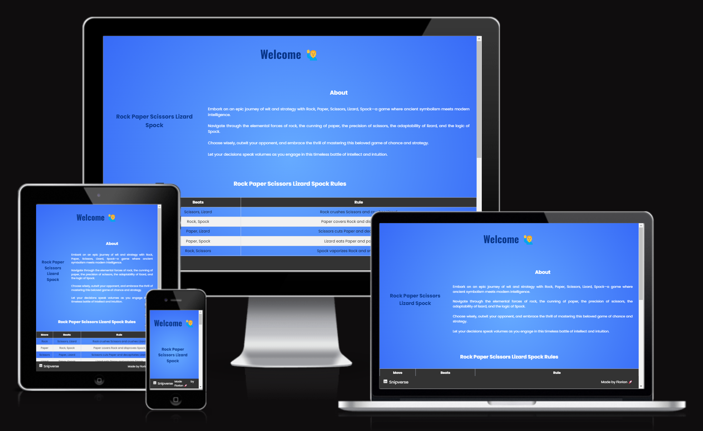
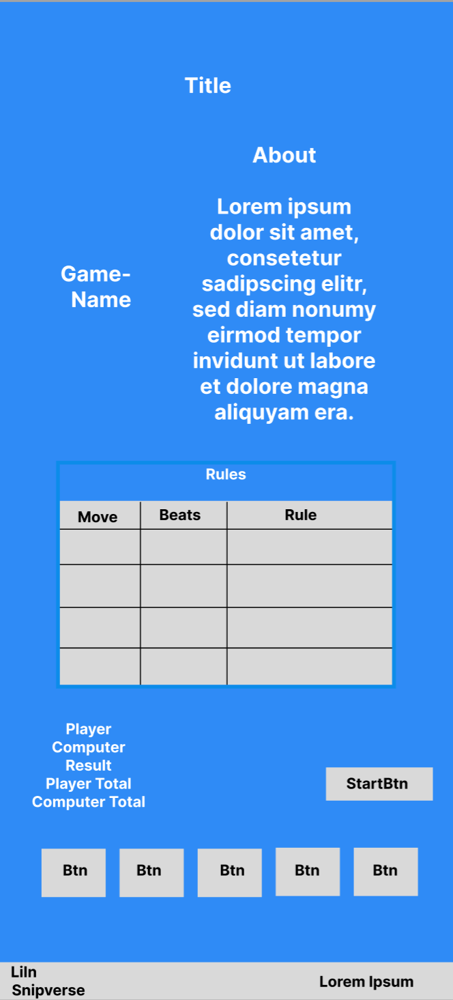
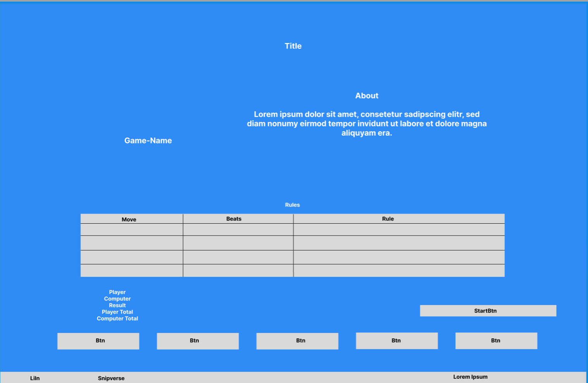
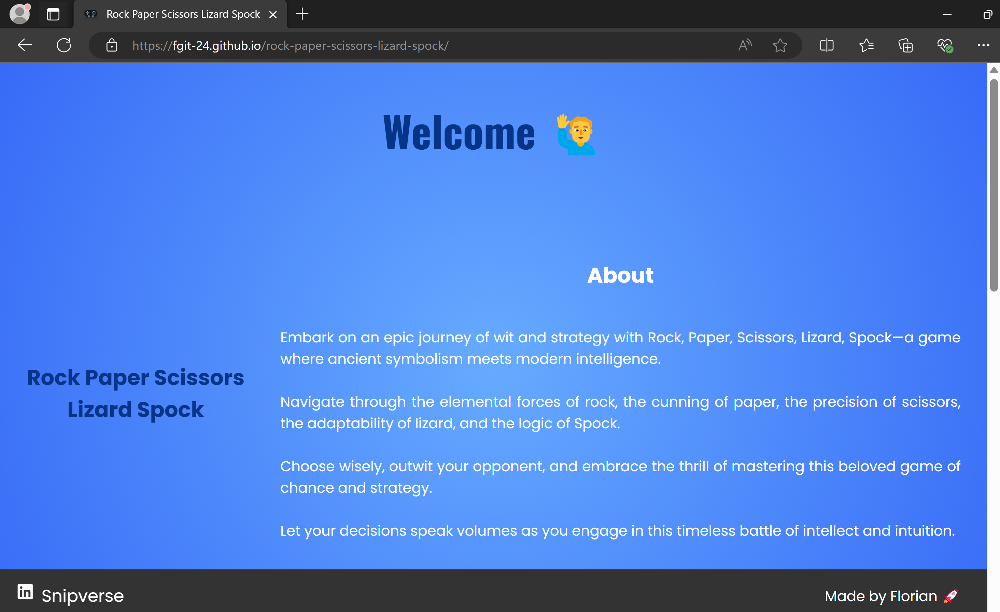
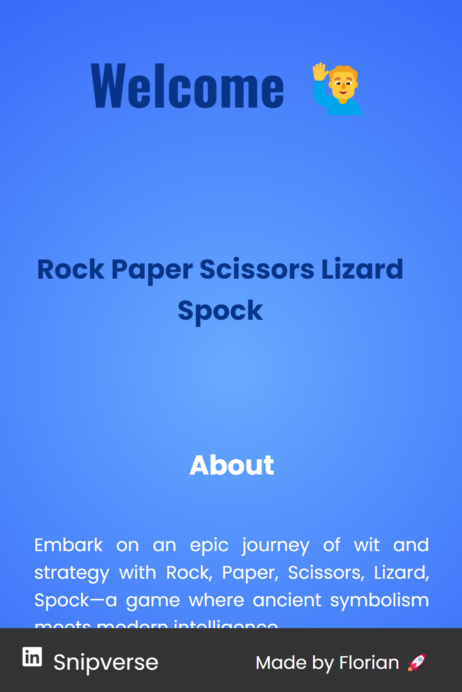

# Rock Paper Scissors Lizard Spock
Enhanced with the powerful Lizard and the wise Spock, my game offers a delightful twist on the classic 'Rock, Paper, Scissors' game.

It brings added depth and excitement compared to the original version!

source: [amiresponsive](https://ui.dev/amiresponsive?url=https://fgit-24.github.io/rock-paper-scissors-lizard-spock)

## UX
I endeavored to maintain a clean and minimalist design for my page, yet I was equally committed to ensuring it remained visually appealing and responsive. 

After crafting my wireframe, I diligently brought it to life.

Blue is a modern and neutral color that perfectly complements my vision of this classic and expresses it visually.

- 'ffffff' used for primary text.
- '000000' used for secondary text.
- '1681d9' used for button.
- '66abff' used for radient background.
- '376af7' used for radient background.
- '073487' used for headlines.

## Root-Variables
I've used CSS `:root` variables to easily update the global colour scheme by changing only one value, instead of everywhere in the CSS file.

    :root {
        --bg-color: white;
        --ft-color: rgb(7, 52, 135);
        font-size: 1rem;
    }

## Typography
I've used Google Fonts and 'Poppins' in most parts, and 'Oswald' for h1.

### Poppins
[Poppins](https://fonts.googleapis.com/css2?family=Oswald:wght@200..700&family=Poppins:ital,wght@0,100;0,200;0,300;0,400;0,500;0,600;0,700;0,800;0,900;1,100;1,200;1,300;1,400;1,500;1,600;1,700;1,800;1,900&display=swap)

### Oswald

[Oswald](https://fonts.googleapis.com/css2?family=Oswald:wght@200..700&display=swap)

### Icon
[Font Awesome](https://fontawesome.com) icons were used throughout the site, such as the social media icons in the footer.

## Wireframe
To follow best practice, wireframes were developed for mobile, tablet, and desktop sizes.
I've used [Figma](https://www.figma.com/) to design my site wireframes.

### Mobile
 - 

### Tablet
 - 

### Desktop
 - 

# Features
My project is split into three different sections.

## About
Describes what my game is about.

## Rules
My 'Rules' section uses a table to provide an easy overview of the rules.

### Game
In the third section I've built the actual game.

## Future
Depending on the games success, I might build a mobile app for it in the future.

## Tools & Technologies Used
-  used to generate README and TESTING templates.
-  used for version control. (`git add`, `git commit`, `git push`)
-  used for secure online code storage.
-  used as a cloud-based IDE for development.
-  used for the main site content.
-  used for the main site design and layout.
-  used for user interaction on the site.
-  used for hosting the deployed front-end site.
-  used for creating wireframes.
-  used for the icons.
-  used to help debug, troubleshoot, and explain things.

## Testing
I have tested my deployed website on desktop browsers (Google Chrome and Microsoft Edge) as well as on mobile devices.

Additionally, I have reviewed the HTML, CSS, and JavaScript, and conducted Lighthouse tests for both desktop and mobile.

### Desktop Google Chrome

### Desktop Microsoft Edge

### Mobile 

### Lighthouse Desktop

### Lighthouse Mobile

### HTML-Validation

[HTML-Validation](https://validator.w3.org/nu/?doc=https%3A%2F%2Ffgit-24.github.io%2Frock-paper-scissors-lizard-spock%2F) 

### CSS-Validation

[CSS-Validation](https://jigsaw.w3.org/css-validator/validator?uri=https%3A%2F%2Ffgit-24.github.io%2Frock-paper-scissors-lizard-spock%2F&profile=css3svg&usermedium=all&warning=1&vextwarning=&lang=en) 

### Javascript-Validation

[JavaScript - Validation](https://jshint.com/)

## Bugs

I realized a bit too late into the development stages after speaking with my mentor that my commit messages / version control could be improved. I proceeded with this method to keep it consistent, but in the future I will adhere closer to the recommended method from Code Institute. The same goes for the naming convention of the documentation image file names.

## Deployment

The site was deployed to GitHub Pages. The steps to deploy are as follows:

- In the [GitHub repository](https://github.com/fgit-24/rock-paper-scissors-lizard-spock), navigate to the Settings tab 
- From the source section drop-down menu, select the **Main** Branch, then click "Save".
- The page will be automatically refreshed with a detailed ribbon display to indicate the successful deployment.

The live link can be found [here](https://fgit-24.github.io/rock-paper-scissors-lizard-spock)

### Local Deployment

This project can be cloned or forked in order to make a local copy on your own system.

#### Cloning

You can clone the repository by following these steps:

1. Go to the [GitHub repository](https://github.com/fgit-24/rock-paper-scissors-lizard-spock) 
2. Locate the Code button above the list of files and click it 
3. Select if you prefer to clone using HTTPS, SSH, or GitHub CLI and click the copy button to copy the URL to your clipboard
4. Open Git Bash or Terminal
5. Change the current working directory to the one where you want the cloned directory
6. In your IDE Terminal, type the following command to clone my repository:
	- `git clone https://github.com/fgit-24/rock-paper-scissors-lizard-spock.git`
7. Press Enter to create your local clone.

Alternatively, if using Gitpod, you can click below to create your own workspace using this repository.

Please note that in order to directly open the project in Gitpod, you need to have the browser extension installed.
A tutorial on how to do that can be found [here](https://www.gitpod.io/docs/configure/user-settings/browser-extension).

#### Forking

By forking the GitHub Repository, we make a copy of the original repository on our GitHub account to view and/or make changes without affecting the original owner's repository.
You can fork this repository by using the following steps:

1. Log in to GitHub and locate the [GitHub Repository](https://github.com/fgit-24/rock-paper-scissors-lizard-spock)
2. At the top of the Repository (not top of page) just above the "Settings" Button on the menu, locate the "Fork" Button.
3. Once clicked, you should now have a copy of the original repository in your own GitHub account!

## Credits

For help with my JavaScript, I've watched a video von Youtube from [BroCode](https://www.youtube.com/watch?v=3uKdQx-SZ5A), but my version is much more advanced and complex.

## Content

| Source | Reason | Notes |
| --- | --- | --- |
| [Markdown Builder](https://tim.2bn.dev/markdown-builder) | README and TESTING | tool to help generate the Markdown files |
| [Font Aweseme](https://fontawesome.com/) | Source for my icon | site for icons and fonts |
| [Google Fonts](https://fonts.google.com/) | Source for my fonts | site for icons and fonts |
| [Youtube](https://youtube.com) | Inspiration | platform for videos |
| [BigBangTheory-Fanpage](https://bigbangtheory.fandom.com) | Images | information site about the famous TV series |
| [HTML-Validator](https://validator.w3.org/) | Validation | tool for HTML-Validation |
| [CSS-Validator](https://jigsaw.w3.org/css-validator/validator.html.en) | Validation | tool for CSS-Validation |
| [Javascript-Validator](https://jshint.com/) | Validation | tool for JavaScript-Validation |

## Media

Source for my Pictures:
[BigBangTheory.fandom.com](https://bigbangtheory.fandom.com/wiki/Rock,_Paper,_Scissors,_Lizard,_Spock)

## Acknowledgements

- I would like to thank my Code Institute mentor, [Tim Nelson](https://github.com/TravelTimN) for his support throughout the development of this project.